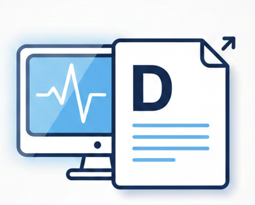

<p align="center">
  
</p>

# DICOM Report Generator


Modern SvelteKit app for designing visual medical reports.

## Quick Start

```
npm install    # Install dependencies
npm run dev    # Start development server

```
